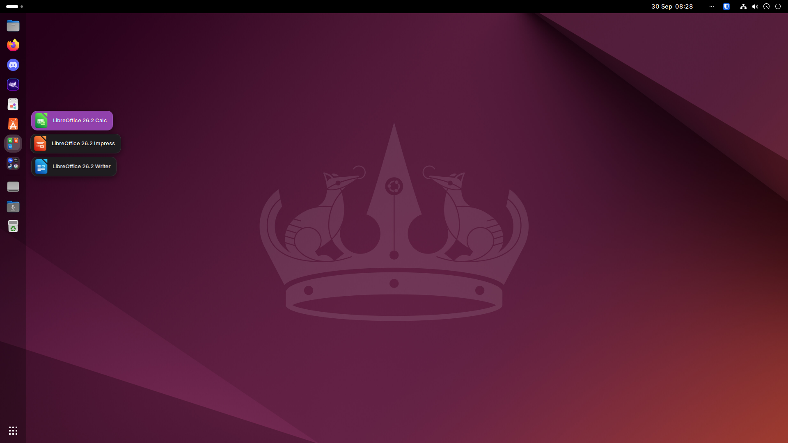
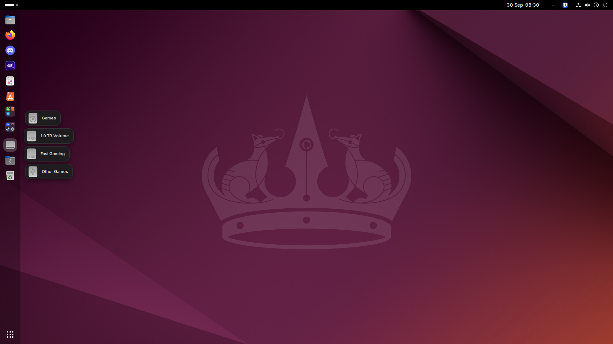
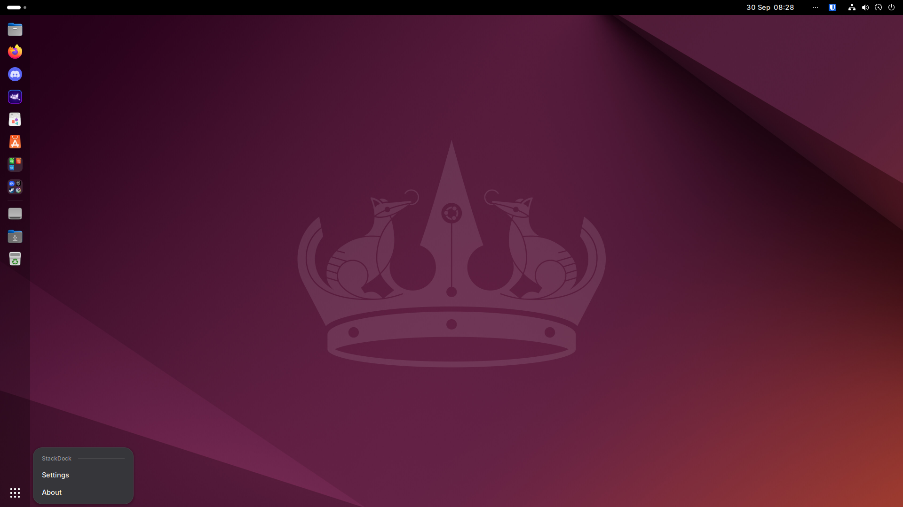
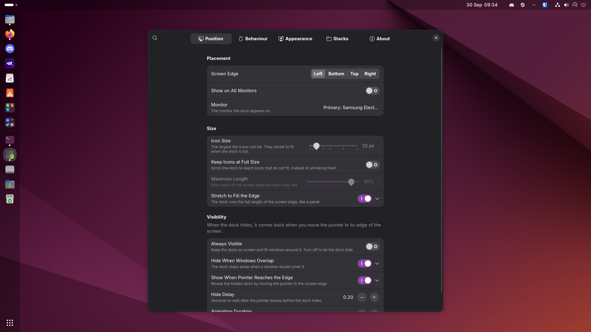
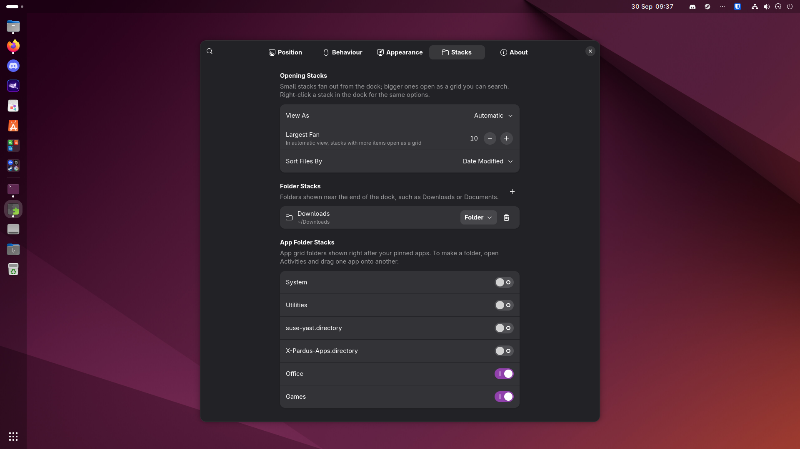
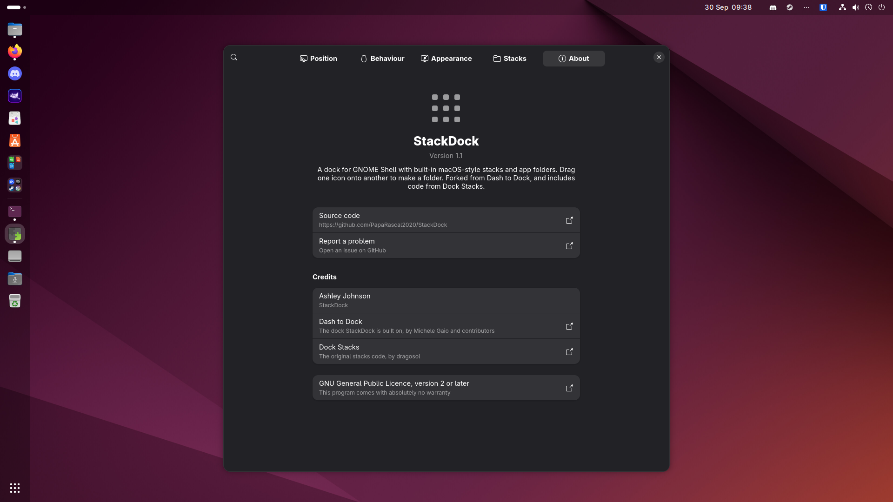

# StackDock

A dock for GNOME Shell with folder stacks, app folders and drives built in.

## Overview

A typical GNOME desktop relies on several separate extensions for its dock, stacks and related tweaks. Each is maintained on its own schedule, so a new GNOME release often leaves some of them marked as incompatible for weeks. Running them together can also cause conflicts, as more than one extension tries to control the same dock.

StackDock brings these features together in a single extension. It is based on [Dash to Dock](https://github.com/micheleg/dash-to-dock), includes stacks adapted from [Dock Stacks](https://github.com/dragosol/dock-stacks), and targets current GNOME Shell releases.

## Features

### Dock

StackDock includes the full Dash to Dock feature set:

- placement on the left, right, top or bottom of the screen
- autohide and intellihide
- multi-monitor support
- running app indicators and window previews
- a comprehensive set of appearance options

### Folder stacks

Any folder, such as Downloads or a project directory, can be pinned to the dock. Clicking it fans out the most recent files beside the dock, and larger folders open as a scrollable, searchable grid. From an open stack you can:

- open a file with a single click
- preview a file with Space (requires GNOME's previewer, Sushi)
- right-click a file for Open With, Show in Files and Move to Trash
- drag a file to a Files window to move it (hold Ctrl to copy), to an app to open it there, or to the desktop

Each folder stack can be displayed as a standard folder icon or as a stack showing the icon of its newest file. Change this with **Display as** in the stack's context menu or in the settings.

### App folder stacks

App grid folders can be kept in the dock, directly after the pinned apps, with a preview of their contents. They behave much like folders on macOS:

- drop one app onto the centre of another to create a folder containing both
- drop an app onto a folder stack to add it
- rename a folder by clicking its title in the grid, or with **Rename Folder** in the context menu
- drag an app out of a folder to remove it, or drop it on the dock to pin it
- a folder is deleted automatically when its last app is removed

### Drives stack

Removable drives, such as USB sticks and memory cards, are grouped into a single Drives stack instead of each occupying a place in the dock. Drives can be ejected or unmounted from the context menu. The stack is hidden when no drives are connected.

### Optional features

These features are disabled by default and can be enabled in the settings:

| Feature | Description |
|---|---|
| Hover previews | Shows a running app's window previews when the pointer rests on its icon, and hides them when the pointer moves away. The delay is configurable. |
| Launch bounce | Animates an app's icon while it starts, stopping once its window appears. |
| Match the top bar | Gives the top bar the same colour and opacity as the dock. |

### Stack options

| Option | Choices |
|---|---|
| View | **Automatic** (a fan for small stacks and a grid for larger ones), **Fan** or **Grid** |
| Fan size | The maximum number of items a fan shows, from 4 to 16. In automatic view, larger stacks open as a grid. |
| Sort order | **Date modified** (newest first), **Name** or **Kind** |

These can be set in the settings or changed from any stack's context menu.

### Configuration

All options are available in a single settings window, which can be opened directly from the dock's context menu. It is built with the standard GNOME (libadwaita) controls and is organised into five pages:

| Page | Contents |
|---|---|
| Position | Screen edge, monitor, icon size, dock length and when the dock hides |
| Behaviour | StackDock's optional features, dock contents, click and scroll actions, window previews, badges and keyboard shortcuts |
| Appearance | Built-in style, background colour and opacity, and running app indicators |
| Stacks | Folder stacks, app folder stacks and drives |
| About | Version, links and credits |

Every option can be found with the search button, and options that depend on another setting only appear, or become available, once that setting is on.

If you are switching from Dash to Dock or Dock Stacks, your existing dock settings and stack folders are imported automatically the first time StackDock starts.

### Keyboard control

Open stacks are fully keyboard accessible:

| Key | Action |
|---|---|
| Arrow keys | Move between items |
| Enter | Open the selected item |
| Space | Preview the selected item |
| Typing | Search |
| Escape | Close the stack |

## Screenshots

| | |
|---|---|
|  |  |
| An app folder stack | The Drives stack |
|  |  |
| Settings and About, available from the dock | Position settings |
|  |  |
| Stacks settings | The About page |

## Requirements

- GNOME Shell 49, 50 or 51
- `git`, `make`, `gettext`, `sassc` and `glib-compile-schemas` to build from source

## Installation

### 1. Install the build dependencies

This step is only needed once.

Ubuntu, Debian, Pop!_OS, PikaOS and derivatives:

    sudo apt install git make gettext sassc libglib2.0-bin

Fedora:

    sudo dnf install git make gettext sassc glib2

Arch Linux and Manjaro:

    sudo pacman -S git make gettext sassc glib2

openSUSE:

    sudo zypper install git make gettext-tools sassc glib2-tools

### 2. Build and install

    git clone https://github.com/PapaRascal2020/StackDock.git
    cd StackDock
    make install

StackDock is installed for the current user in `~/.local/share/gnome-shell/extensions/stackdock@ashleyj`. Root privileges are not required.

### 3. Disable other docks

StackDock replaces other dock extensions, and running more than one dock at a time causes conflicts. To list the enabled extensions:

    gnome-extensions list --enabled

Disable any of the following that appear:

    gnome-extensions disable dash-to-dock@micxgx.gmail.com
    gnome-extensions disable ubuntu-dock@ubuntu.com
    gnome-extensions disable dock-stacks@dragosr

### 4. Restart GNOME Shell

GNOME Shell only detects newly installed extensions after a restart. Log out and log back in.

### 5. Enable StackDock

    gnome-extensions enable stackdock@ashleyj

Alternatively, enable it in the Extensions app.

### 6. Configure stacks

Open the settings:

    gnome-extensions prefs stackdock@ashleyj

On the **Stacks** page:

- select **+** under Folder Stacks to add a folder
- enable any app folders you want in the dock under App Folder Stacks. New app folders can be created by dropping one app onto another in the dock.

Existing Dash to Dock settings and Dock Stacks folders are imported automatically the first time StackDock starts.

## Updating

    cd StackDock
    git pull
    make install

Log out and back in to load the new version.

## Uninstalling

    gnome-extensions disable stackdock@ashleyj
    rm -rf ~/.local/share/gnome-shell/extensions/stackdock@ashleyj

Log out and back in to complete the removal.

## Troubleshooting

To check the GNOME Shell log for errors:

    journalctl --user -b | grep -i stackdock

If you find a problem, please [open an issue](https://github.com/PapaRascal2020/StackDock/issues) with a description of what you were doing, your GNOME Shell version (`gnome-shell --version`) and any relevant log output.

## Translations

Translation files are in the [po](po) directory, with the template in `po/stackdock.pot`. Many translations were inherited from Dash to Dock, but the settings pages were rewritten for StackDock, so most of their text still needs translating. To refresh the files after changing the source, run:

    make mergepo

Contributions are welcome as pull requests.

## Credits

- Based on [Dash to Dock](https://github.com/micheleg/dash-to-dock) by Michele Gaio and contributors. The original README is preserved in [README.upstream.md](README.upstream.md).
- Stacks code adapted from [Dock Stacks](https://github.com/dragosol/dock-stacks) by dragosol.

## Licence

StackDock is released under the GNU General Public Licence, version 2 or later. See [COPYING](COPYING) for details.
